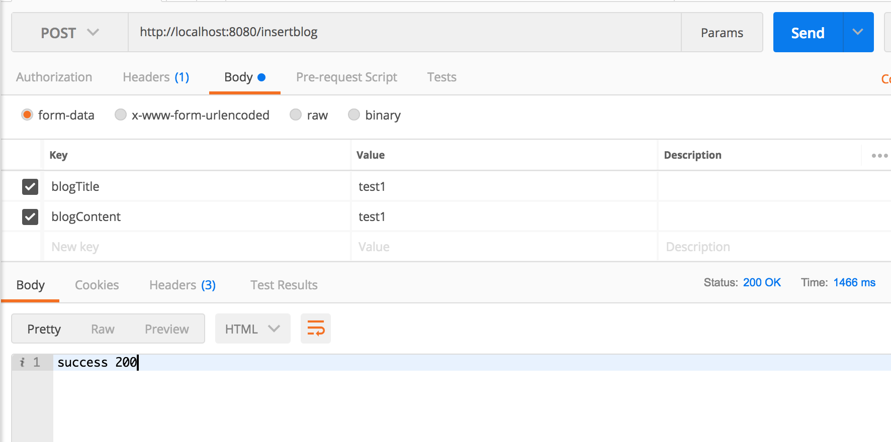
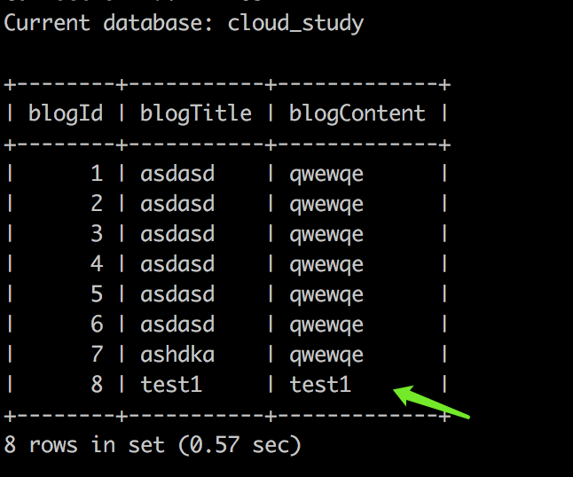
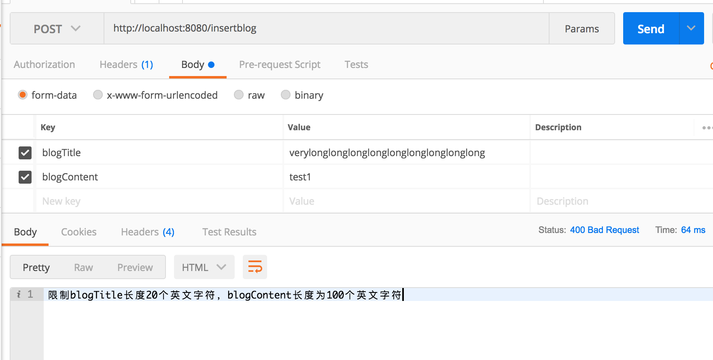

# Spring MVC

## 要求

假设有如下数据表：

```sql
create table Blog(

blogId int auto_increment primary key comment "博客Id",  

blogTitle varchar(10) comment "博客标题",

blogContent varchar(100) comment "博客内容" )

ENGINE=InnoDB  DEFAULT CHARSET=utf8;
```


提供一个发表博客的接口，可以通过POST方法（表单）提交两个参数，blogTitle，blogContent，类型为String，并且限制blogTitle长度20个英文字符，blogContent长度为100个英文字符（假设客户端传过来的内容都为英文字符），如果内容不符合长度要求，向客户端返回400响应码，如果符合长度要求，则将内容保存到Blog数据表中，并返回200响应码给客户端。

## 部分代码
1. Blog类
```java
public class Blog {
    private String blogTitle;
    private String blogContent;

    public String getBlogTitle() {
        return blogTitle;
    }

    public void setBlogTitle(String blogTitle) {
        this.blogTitle = blogTitle;
    }

    public String getBlogContent() {
        return blogContent;
    }

    public void setBlogContent(String blogContent) {
        this.blogContent = blogContent;
    }
}
```

2. BlogDao，Blog数据库访问接口
```java
@Mapper
public interface BlogDao{

	@Select("Select * from Blog")
	public List<Blog> getBlogList();

	@Insert("insert into Blog (blogTitle, blogContent) values (#{param1}, #{param2})")
	public void insertBlog(String blogTitle, String blogContent);
	
}
```

3. BlogService，Blog对应的业务逻辑层
```java
@Service
public class BlogService {

    @Resource
    private BlogDao dao;

    public List<Blog> getBlogList() {
        return dao.getBlogList();
    }

    public void insertBlog(String blogTitle, String blogContent) throws Exception {
        if (blogTitle.length() <= 20 && blogContent.length() <= 100) {
            dao.insertBlog(blogTitle, blogContent);
        } else {
            throw new Exception("限制blogTitle长度20个英文字符，blogContent长度为100个英文字符");
        }
    }
}
```

4. BlogController，控制层，调用业务逻辑BlogService，返回对应的视图名称和数据
```java
@Controller
public class BlogController {

    @Autowired
    private BlogService blogService;

    @RequestMapping(path = { "/insertblog" })
    @ResponseBody
    public String insertBlog(@RequestParam String blogTitle, @RequestParam String blogContent,
            HttpServletResponse response) {
        try {
            blogService.insertBlog(blogTitle, blogContent);    
        } catch (Exception e) {
            response.setStatus(400);
            return e.getMessage();
        }
        
        return "success 200";
    }
}
```


## 结果展示

1. 添加成功，返回的Status 200



2. 添加失败，返回的status 400
