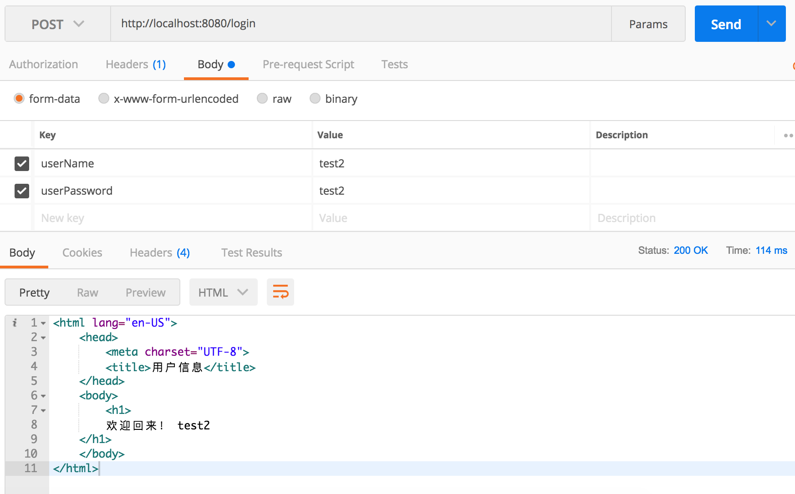
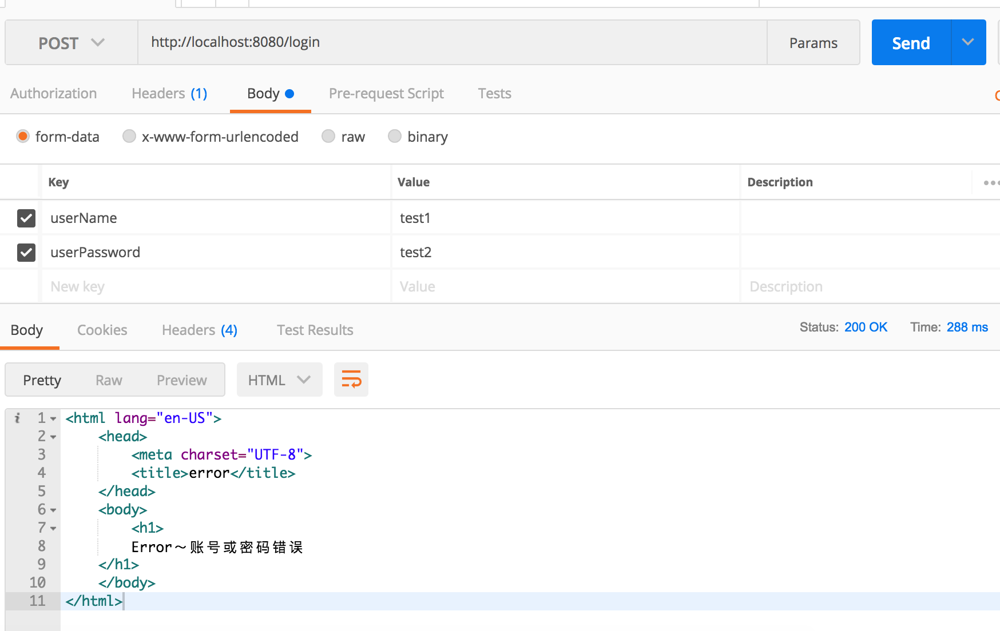

# Spring MVC

## 要求

完成一个具有登陆功能的简单Web工程，要求：

1. 提供一个简单的登陆表单，用户可以输入用户名（userName），密码（userPassword），点击提交后登陆；

2. 后端提供一个登陆接口（login），可以判断用户是否是合法用户（从创建好的用户表中查询数据，可预先在数据库中插入几条数据）；

3. 登陆成功后，显示用户信息页面（user），内容自定义，如显示用户名，并给出一个欢迎消息；

4. 如果未登陆用户直接访问用户信息页面（user），向客户端返回一个错误页面（error），内容自定义，如提示用户未登陆等。


注：

1. 建表及插入语句
```sql
create table User(

userId int auto_increment primary key comment "用户Id",  

userName varchar(100) comment "用户名称",

userPassword varchar(100) comment "用户密码" )

ENGINE=InnoDB  DEFAULT CHARSET=utf8;


insert into User (userName, userPassword) values ("test1", "test1")

insert into User (userName, userPassword) values ("test2", "test2")
```
上述语句插入两个用户test1及test2，密码分别为test1，test2


2. 需要用到cookie及session相关内容来检查当前请求是否为登陆用户的请求；

## 部分代码
1. UserDao，User数据库访问接口
```java
@Mapper
public interface UserDao{

	@Select("Select * from User")
	public List<User> getUserList();

	@Select("Select * from User where userName = #{param1} and userPassword = #{param2}")
	public List<User> login(String userName, String userPassword);
}
```

2. UserService，User对应的业务逻辑层
```java
@Service
public class UserService {

    @Resource
    private UserDao dao;

    public List<User> getUserList() {
        return dao.getUserList();
    }

    public Map<String, Object> getUserListMap() {
        Map<String, Object> root = new HashMap<String, Object>();
        root.put("userList", this.getUserList());
        return root;
    }

    public User login(String userName, String userPassword) throws Exception{
        List<User> list = dao.login(userName, userPassword);
        return list.get(0);
    }
}
```

3. UserController，控制层，调用业务逻辑UserService，返回对应的视图名称和数据
```java
@Controller
public class UserController {

    @Autowired
    private UserService userService;

    @RequestMapping(path = { "/login" })
    public String userList(@RequestParam String userName, @RequestParam String userPassword, Model model) {
        try {
            User user = this.userService.login(userName, userPassword);
            model.addAttribute("user", user);

            return "user";
        } catch (Exception e) {
            return "error";
        }

    }
}
```

4. user.ftl && error.ftl 使用FreeMarker渲染的视图文件
```xml
<html lang="en-US">
<head>
    <meta charset="UTF-8">
    <title>用户信息</title>
</head>
<body>
    <table>
        <thead>
            <tr>
                <td>userId</td>
                <td>userName</td>
            </tr>
        </thead>
        <tbody>
            <#list userList as user>
                <tr>
                    <td>${user.userId}</td>
                    <td>${user.userName}</td>
                </tr>
            </#list>
        </tbody>
    </table>
</body>
</html>
```

```xml
<html lang="en-US">

<head>
    <meta charset="UTF-8">
    <title>用户信息</title>
</head>

<body>
    <h1>
        欢迎回来！ ${user.userName}
    </h1>
</body>

</html>
```

## 结果展示

1. 登陆成功


2. 登陆失败

