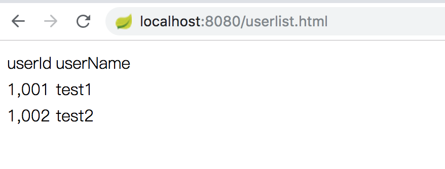
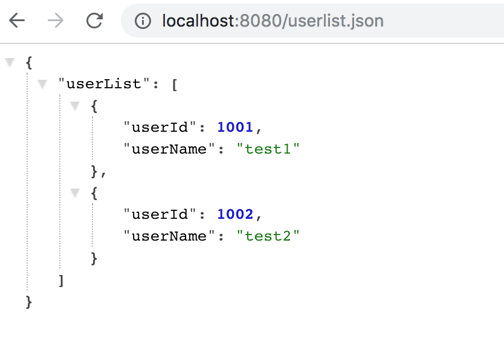

# Spring MVC

## 要求

提供一个接口，该接口可以根据需要（扩展名，Accept头）返回一个HTML文档或者JSON数据，要求：
1. 返回的JSON数据是一个用户列表，每个用户包含两个信息：用户Id（userId），用户名（userName），最终的数据类似：

```json
{
    "userList" : [
        {
            "userId": 1001,
            "userName": "test1"
        },
        {
            "userId": 1002,
            "userName": "test2"
        }
        ...
    ]
}
```

2. 返回的HTML文档基于FreeMarker生成，内容是一个用户列表的表格；
3. 返回的数据从数据库表里查询出来的；
4. 根据项目模板里介绍的内容组织代码及资源。

## 实现
1. 使用gradle构建以及管理依赖。
2. 使用spring-boot简化配置。

## 部分代码
1. user.sql: 数据库初始化
```sql
DROP TABLE IF EXISTS `User`;
CREATE TABLE `User` (
  `userId` int(11) NOT NULL AUTO_INCREMENT,
  `userName` VARCHAR(40) NOT NULL,
  PRIMARY KEY (`userId`)
) ENGINE=InnoDB AUTO_INCREMENT=3 DEFAULT CHARSET=utf8;

-- ----------------------------
-- Records of User
-- ----------------------------
INSERT INTO `User` VALUES ('1001', 'test1');
INSERT INTO `User` VALUES ('1002', 'test2');
```

2. WebConfig.java: 配置ContentNegotiatingViewResolver实现内容协商，扩展名或者Accept头返回HTML文档或者JSON数据，优先级（扩展名 > Parameter > Accept头）

```java
    @Bean
	public ContentNegotiatingViewResolver contentNegotiatingViewResolver(ContentNegotiationManager manager,
			List<ViewResolver> viewResolvers) {

		ContentNegotiatingViewResolver viewResolver = new ContentNegotiatingViewResolver();
		viewResolver.setContentNegotiationManager(manager);

		// 设置默认view, default view 每次都会添加到 真正可用的视图列表中, json视图没有对应的ViewResolver
		View jackson2JsonView = new MappingJackson2JsonView();
		viewResolver.setDefaultViews(Collections.singletonList(jackson2JsonView));

		viewResolver.setViewResolvers(viewResolvers);
		return viewResolver;
    }
    
    @Override
	public void configureContentNegotiation(ContentNegotiationConfigurer configurer) {
		configurer.favorPathExtension(true).favorParameter(true).parameterName("format").ignoreAcceptHeader(false)

				/* 请求以.html结尾的会被当成MediaType.TEXT_HTML */
				.mediaType("html", MediaType.TEXT_HTML)
				/* 请求以.json结尾的会被当成MediaType.APPLICATION_JSON */
				.mediaType("json", MediaType.APPLICATION_JSON).defaultContentType(MediaType.APPLICATION_JSON);
	}
```

3. UserDao，User数据库访问接口
```java
@Mapper
public interface UserDao{

	@Select("Select * from User")
	public List<User> getUserList();

}
```

4. UserService，User对应的业务逻辑层
```java
@Service
public class UserService {

    @Resource
    private UserDao dao;

    public List<User> getUserList() {
        return dao.getUserList();
    }

    public Map<String, Object> getUserListMap() {
        Map<String, Object> root = new HashMap<String, Object>();
        root.put("userList", this.getUserList());
        return root;
    }
}
```

5. UserController，控制层，调用业务逻辑UserService，返回对应的视图名称和数据
```java
@Controller
public class UserController {

    @Autowired
    private UserService userService;

    @RequestMapping(path = { "/userlist"})
    public String userList(Model model) {
        model.addAttribute("userList", this.userService.getUserList());

        return "user";
    }
}
```

6. user.ftl 使用FreeMarker渲染的视图文件
```xml
<html lang="en-US">
<head>
    <meta charset="UTF-8">
    <title>用户信息</title>
</head>
<body>
    <table>
        <thead>
            <tr>
                <td>userId</td>
                <td>userName</td>
            </tr>
        </thead>
        <tbody>
            <#list userList as user>
                <tr>
                    <td>${user.userId}</td>
                    <td>${user.userName}</td>
                </tr>
            </#list>
        </tbody>
    </table>
</body>
</html>
```

## 结果展示

1. HTML头


2. JSON头


3. html后缀


4. json后缀

